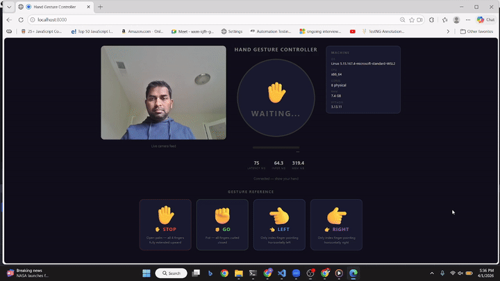

# detectHandGesture

Real-time hand gesture recognition over WebSocket — browser streams webcam frames to Python, Python classifies and smooths, browser displays the result.



---

## How It Works

```
Browser                          Python (FastAPI)
───────                          ────────────────
Webcam → JPEG frame
         ──────────── WebSocket ──▶  Decode frame
                                     │
                                     ▼
                                  MediaPipe
                                  HandLandmarker
                                     │  21 (x,y,z) landmarks
                                     ▼
                                  Classifier
                                     │  (gesture, confidence)
                                     ▼
                                  Smoother
                                     │  majority vote / 9 frames
                                     ▼
         ◀─────────── WebSocket ──  { command, confidence,
                                      landmarks, infer_ms, mem_mb }
Draw skeleton on canvas
Update gesture display
Show stats
```

---

## Classification

MediaPipe returns 21 landmarks on the hand. The classifier uses only 9 of them:

```
        8 (tip)
        |
        7
        |
        6 (pip)
        |
   5 (mcp) ─── wrist (0)
```

**STOP** — all 4 fingers extended upward

```
tip.y < pip.y  for index + middle + ring + pinky  →  all 4 up  →  STOP

  8  12  16  20       confidence = avg margin of (pip.y - tip.y)
  |   |   |   |                   normalised to 0–1
  6  10  14  18
  |   |   |   |
  5   9  13  17
```

**GO** — all 4 fingers curled

```
tip.y > pip.y  for index + middle + ring + pinky  →  all 4 down  →  GO

  5   9  13  17
  |   |   |   |
  6  10  14  18
  |   |   |   |
  8  12  16  20       confidence = avg margin of (tip.y - pip.y)
```

**TURN LEFT / TURN RIGHT** — direction vector from MCP(5) → Tip(8)

```
  5 ──────────────▶ 8          dx = tip.x - mcp.x
                               dy = tip.y - mcp.y

  condition:  finger_len > 0.08  and  |dx| > |dy| × 0.8
              (finger must be extended, more horizontal than vertical)

  dx > 0  →  TURN RIGHT          dx < 0  →  TURN LEFT
  ──────────────────────         ──────────────────────
  5 ──────────────▶ 8            8 ◀────────────── 5

  confidence = |dx| / finger_len   (1.0 = perfectly horizontal)
```

---

## Smoothing

Raw per-frame predictions flicker. A sliding window of the last **9 frames** is kept per connection. The majority gesture wins — but only if it clears two gates:

```
Frame history (newest → oldest):
  GO  GO  STOP  GO  GO  GO  STOP  GO  GO

  Count:  GO = 7,  STOP = 2

  Gate 1 — majority:    7 ≥ 5  (ceil(9/2))  ✓
  Gate 2 — confidence:  avg(GO confidence) ≥ 0.55  ✓

  Output: GO
```

```
Frame history (ambiguous):
  STOP  GO  LEFT  GO  STOP  LEFT  GO  STOP  LEFT

  Count:  GO = 3,  STOP = 3,  LEFT = 3

  Gate 1 — majority:  3 < 5  ✗

  Output: none  (no gesture shown)
```

When the hand leaves the frame, the history is cleared immediately.

---

## Gestures

| Show your hand | Command |
|---|---|
| ✋ Open palm, all fingers up | STOP |
| ✊ Fist, all fingers curled | GO |
| 👈 Index pointing left (horizontal) | TURN LEFT |
| 👉 Index pointing right (horizontal) | TURN RIGHT |

---

## Project Structure

```
detectHandGesture/
├── main.py                   # FastAPI server, MediaPipe inference, WebSocket
├── templates/index.html      # UI — camera feed, gesture display, stats
├── static/
│   └── hand_landmarker.task  # MediaPipe model (~5 MB, local)
├── demo/demo.mp4
└── pyproject.toml
```

---

## Setup

```bash
uv sync
uv run main.py
# Open http://localhost:8000
```
